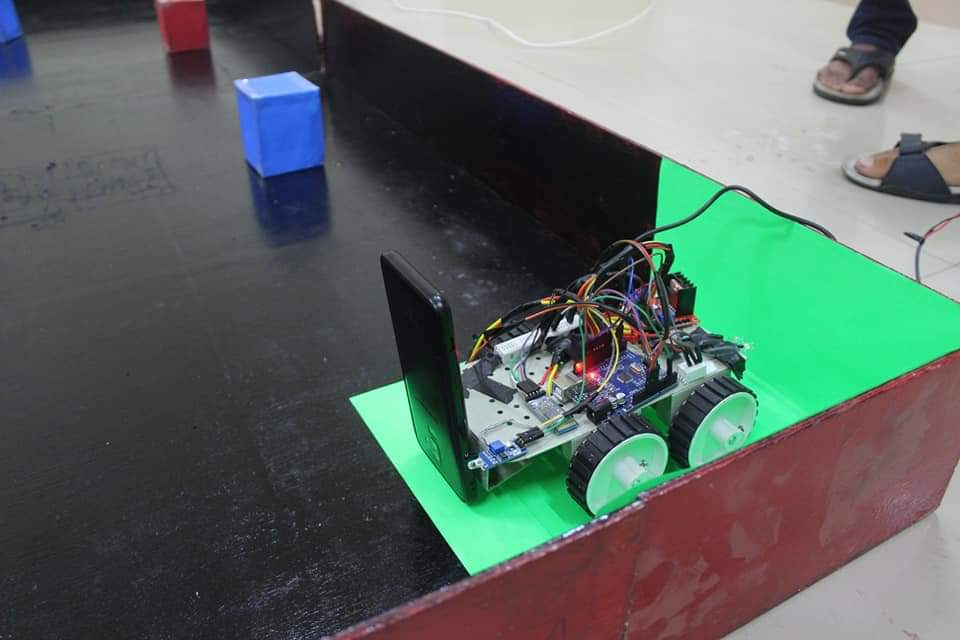
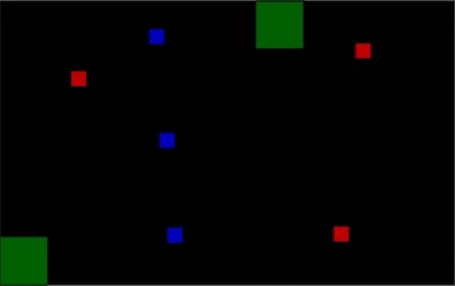

# VISION'20

## INTRODUCTION
### Search and Destroy :
Call of Duty has started a series of arcade games with varieties of objectives. But most of them focus on finding and killing opponents. Your team wants you to create a special autonomous killer bot which searches the opponent and destroys them all, so as to win the game.

## TASK
Design a Completely Autonomous robot which could detect and hit the targets. *The game involves the use of Camera, which would be used to give command for the locomotion by detecting the targets, Laptop, to process the data of camera and send commands to bot.

## TASK DESCRIPTION
The game starts with the bot waiting at the start location. It should start observing the arena from the camera and search for RED boxes. Algorithms should be such that it takes the image from an on board camera, processes it and sends commands to the arduino for further movement. As soon as the camera encounters a RED box it should move towards it. Arena would have 3 RED boxes and 3 or 2 BLUE boxes. Your bot should avoid hitting the BLUE boxes. When all 3 RED boxes are removed bot should go to any of the GREEN marked nodes (finish nodes). When the bot hits the red box or reaches the finish nodes it should glow a RED LED giving us command to remove the box from the arena or to stop time. The RED boxes would also be considered as checkpoints so in any case of wrong motion or hitting the arena bot would be placed to the last checkpoint. The Background will be Black and the boxes will be Red and Blue. If any team assumes manual control at any time during the game it will be immediately disqualified. In case of any change in colors, details would be shared on the group.

## BOT SPECIFICATIONS
• The Bot should be fully autonomous. Cables are allowed to send command to arduino. *wired bot in case you are using an adapter and wireless in case you use a battery for power supply. • The dimensions of bot at the start of the game should not exceed 25cm x 25cm x 25cm .In other words, each of the robots should completely fit within a box having respective dimensions. • The weight of the robot should not exceed 5 kg. The remote control (wireless/wired), batteries etc. all of which is to be included in the weight. • The potential difference between any two points in the robot should not exceed 12V at any point of time during the match. • Teams will be provided a power supply (220V AC supply) in the arena, teams have to bring their own adapters (for 12V-2A power supply). • The rpm of the motor should not exceed 300rpm

## BOT USED

## GAMEPLAY
1.Each match will have a total time limit of 5 minutes.
2.The game will start with bot at the start point of the arena.
3.As the game starts the Bot have to find/detect the opponents (box) and destroy (hit) it. The bot should be completely autonomous, which means it should use the data to camera and process it to make decisions for movement. When all 3 opponents are destroyed bot has to go to either of the finish nodes (GREEN marked) autonomously.
4.All the objects and nodes will be distinguishable. A camera placed on the bot facing front would be able to detect all the objects and nodes easily.
5.RED marked squares represents opponents and BLUE marked squares represents teammates.
6.Rules for Tie breaker will be disclosed at the time of the event.
7.The time of the match will only be recorded from referees' stopwatch.

## ARENA 

#### Code for mobility : [vision.ino](vision.ino)
